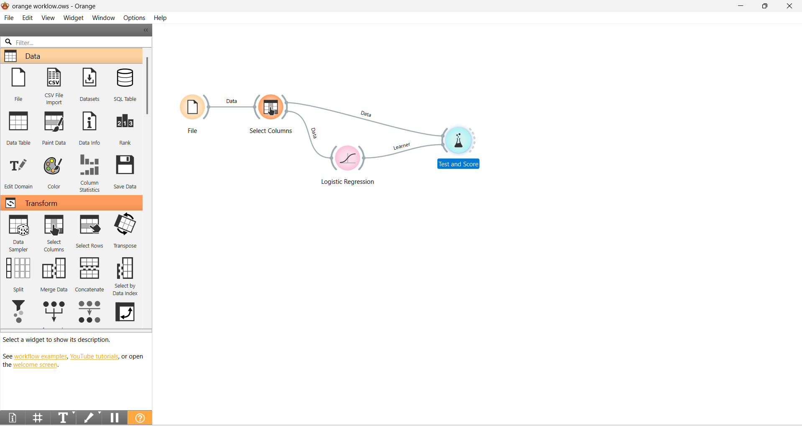

# Predictive Modeling with Orange Data Mining: Logistic Regression

This repository contains a visual machine learning workflow built using **Orange Data Mining**. The pipeline processes an incoming dataset, filters target/feature variables, applies a **Logistic Regression** classifier, and evaluates the model's predictive performance.

---

## 🛠️ Workflow Architecture

The entire data pipelining and training process is constructed visually via individual specialized widgets linked sequentially:

### Widget Breakdown & Data Flow:
1. **File:** Ingests the raw dataset into the runtime environment.
2. **Select Columns:** Configures the data schema by assigning independent variables as **Features** and the prediction objective as the **Target** variable.
3. **Logistic Regression:** A supervised classification algorithm used to calculate class probabilities using a logistic function.
4. **Test and Score:** Executes cross-validation or a train/test split to benchmark the predictive capabilities of the model.

---

## 📈 Model Performance & Evaluation Results

Double-clicking the evaluation widgets inside Orange yields the following performance benchmarks for the Logistic Regression model:

### 1. Test and Score Metrics
The model evaluation calculates key statistical indicators including **AUC (Area Under ROC)**, **Classification Accuracy (CA)**, **F1-Score**, **Precision**, and **Recall**.

### 2. Confusion Matrix
Provides a granular view of the True Positives, True Negatives, False Positives, and False Negatives to evaluate where the model is misclassifying instances.

### 3. ROC Analysis
Plots the True Positive Rate against the False Positive Rate across various threshold settings to visually assess model discriminative ability.

---

## 🚀 How to Replicate This Workflow

1. Download and install [Orange Data Mining](https://orangedatamining.com/).
2. Clone this repository locally.
3. Open Orange, navigate to `File -> Open`, and select the provided `.ows` file (`orange workflow.ows`).
4. Double-click the **File** widget to point it toward your local data source.
5. Open the **Test and Score** widget to view live model evaluation metrics.
